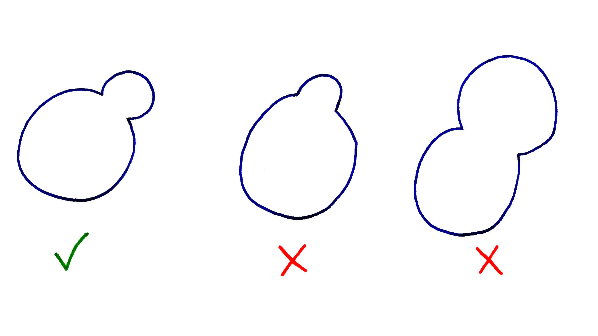

# Réunion du 10 mai 2019

## Participants

Encadrants du projet :
* J. COUSTY : `jean.cousty@esiee.fr`
* Y. KENMOCHI : `yukiko.kenmochi@esiee.fr`

Participants du projet :
* Clément CHOMICKI : `clement.chomicki@edu.esiee.fr`
* Amaury BARUZY : `amaury.baruzy@edu.esiee.fr`
* Alexandre LEBLON : `alexandre.leblon@edu.esiee.fr`
* Maylis MONTANI : `maylis.montani@edu.esiee.fr`
* Barbara PARE  : `barbara.pare@edu.esiee.fr`

## Compte-rendu de la réunion

Comment séparer deux grains de sable ?
La méthode que nous avons vue ne fonctionne que pour deux grains peu "fusionnés".

Nous avons deux outils :
* La carte de distances,
* Et la ligne de partage des eaux.

Ces méthodes ne fonctionnent que dans un certain cas :

Pour compter le nombre de grains à séparer, nous pouvons utiliser la méthode de la carte de distances.

Pour séparer deux grains, nous pouvons utiliser la méthode de la ligne de partage des eaux.
En étude du mouvement de l'eau, la ligne de partage des eaux est le limite d'attraction des mers et océans sur la terre.

Ainsi, sur l'exemple précédent, on obtient :

Sur notre environnement graphique, ça serait bien de pouvoir faire défiler les coupes et le temps avec deux curseurs... C'est mieux qu'un menu pour sélectionner les grains.

**Note en plus Amaury :** C'est faisable super facilement avec ce que j'ai déjà fait. :D
